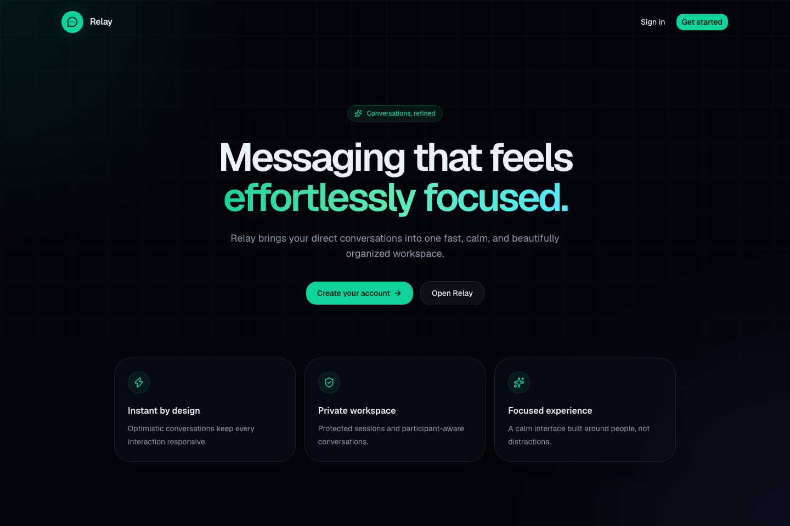
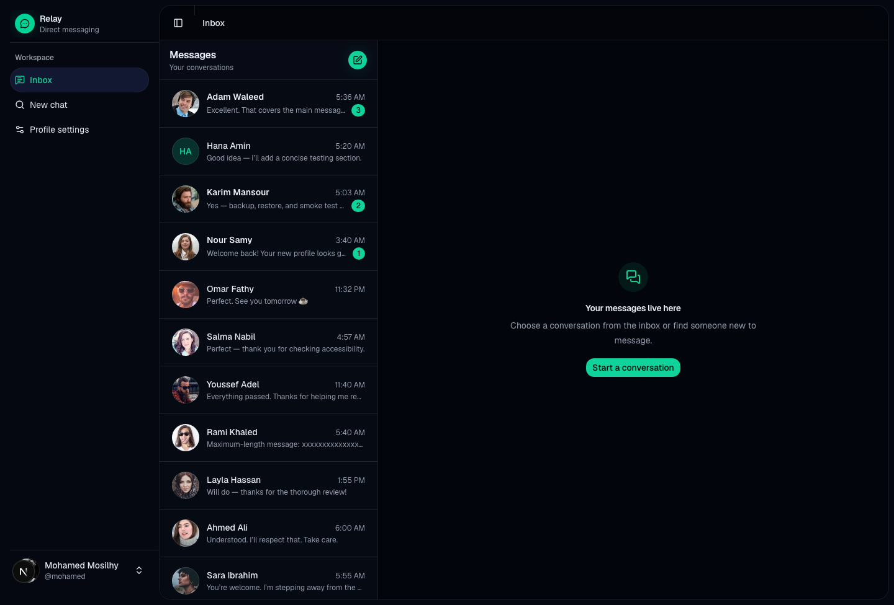
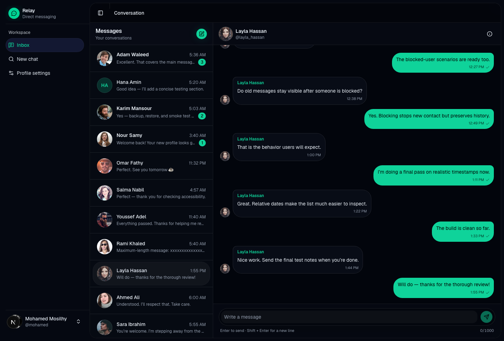
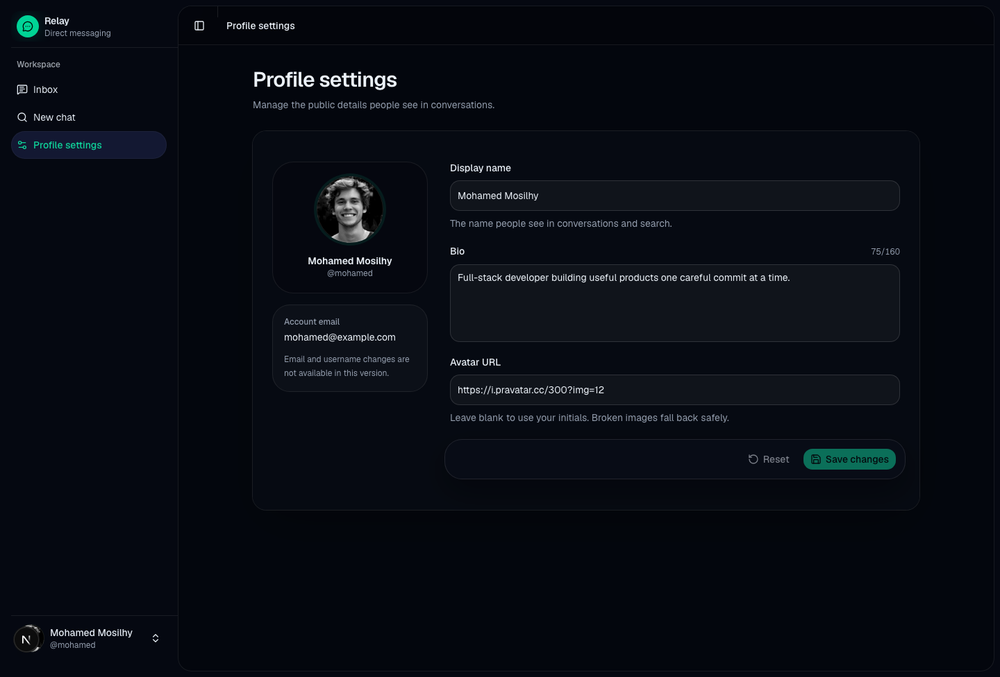

<div align="center">
  

# Relay

A production-ready direct-messaging application with optimistic delivery,
secure sessions, cursor pagination, and a premium responsive interface.

[Live demo](https://relay-messaging-app.vercel.app) ·
[Documentation](./docs/README.md) ·
[Architecture](./docs/02-Architecture/Architecture.md) ·
[Roadmap](./docs/01-Product/Roadmap.md)

</div>



## Demo account

Use the seeded account on the live demo:

```text
Email:    mohamed@example.com
Password: Test12345
```

The demo dataset is intentionally fictional and may be reset. Do not enter
private or sensitive information.

## What Relay demonstrates

- Credentials authentication with Auth.js and bcrypt.
- Protected, participant-authorized direct conversations.
- Stable `createdAt` + `id` cursor pagination.
- Concurrent optimistic sends with per-message failure state.
- Sender-scoped message idempotency and safe retries.
- Persistent failed-message Retry and Remove actions.
- Transactional latest-message metadata and unread counts.
- Per-conversation browser drafts.
- Block-aware discovery, conversation creation, and sending.
- Responsive desktop/mobile application shell.
- Accessible loading, empty, error, keyboard, and focus states.
- Strict API validation, structured errors, request IDs, and health checks.
- Database-backed rate limiting suitable for multiple serverless instances.
- CSP and browser security headers.

## Screenshots

| Inbox                                               | Conversation                                                      |
| --------------------------------------------------- | ----------------------------------------------------------------- |
|  |  |

| Profile settings                                                          |
| ------------------------------------------------------------------------- |
|  |

## Technology

| Layer          | Technology                                  |
| -------------- | ------------------------------------------- |
| Framework      | Next.js 16 App Router, React 19, TypeScript |
| Styling        | Tailwind CSS 4, shadcn/ui, Radix UI, Lucide |
| Server state   | TanStack React Query                        |
| Authentication | Auth.js credentials sessions, bcrypt        |
| Validation     | Zod                                         |
| Database       | PostgreSQL, Prisma ORM, Prisma PG adapter   |
| Testing        | Vitest, Playwright, axe-core                |
| Hosting        | Vercel with serverless PostgreSQL           |

## Architecture

Relay keeps transport, business rules, persistence, client state, and
presentation separate:

```text
Browser UI
  -> React Query hooks and request actions
    -> Next.js route handlers
      -> feature services
        -> Prisma
          -> PostgreSQL
```

Business authorization and multi-write invariants live in services, not in
pages or components. Route handlers own HTTP parsing and response mapping.
React Query owns remote browser state; local drafts remain browser-owned.

Read the detailed [architecture documentation](./docs/02-Architecture/Architecture.md)
and [repository map](./docs/07-Reference/Repository-Map.md).

## Local development

### Requirements

- Node.js 24 recommended (`.nvmrc`), or another version allowed by
  `package.json`.
- pnpm 11.17.0.
- PostgreSQL.

### Setup

```bash
pnpm install
cp .env.example .env
pnpm db:deploy
pnpm db:seed
pnpm dev
```

Open [http://localhost:3000](http://localhost:3000).

Environment variables:

```dotenv
DATABASE_URL=postgresql://...
AUTH_SECRET=generate-a-long-random-secret
AUTH_URL=http://localhost:3000
HASHING_SALT=10
```

Never commit real environment values. The included `.env.example` contains
safe placeholders only.

## Complete test dataset

`pnpm db:seed` resets the configured database and creates:

- 36 fictional users and two ready login accounts;
- 12 direct conversations and 104 messages;
- a three-page message thread;
- equal timestamps for cursor tie-breaking;
- unread badges with counts 1, 2, and 3;
- an empty conversation;
- a 1,000-character message;
- missing avatar and bio fallbacks;
- more than two pages of matching search users;
- both directions of blocked relationships;
- a discoverable user without an existing conversation.

The seed is destructive. Run it only against a disposable development,
testing, or demo database.

## Quality commands

```bash
pnpm format:check
pnpm lint
pnpm typecheck
pnpm test
pnpm test:e2e
pnpm build
pnpm screenshots
```

For a disposable database, `pnpm test:e2e:seeded` resets the seed before
running desktop and mobile browser tests.

## Deployment

The production application is deployed on Vercel:

**https://relay-messaging-app.vercel.app**

Production releases require:

1. a pooled PostgreSQL `DATABASE_URL`;
2. `AUTH_SECRET` and the production `AUTH_URL`;
3. `pnpm db:deploy` against the production database;
4. successful lint, type, unit, browser, and build gates;
5. health and authentication smoke checks after deployment.

See the full [deployment and rollback guide](./docs/06-Engineering/Deployment.md).

## Project status

Phases 0–4 and Phase 6 are complete. Phase 5—real-time WebSocket delivery—is
intentionally left for the project author to implement as a learning exercise.
The existing client IDs, idempotent send service, and cache reconciliation form
the foundation for that work.

## Documentation

The documentation is organized by topic:

- [Product](./docs/01-Product/)
- [Architecture](./docs/02-Architecture/)
- [Backend](./docs/03-Backend/)
- [Frontend](./docs/04-Frontend/)
- [Real-time plan](./docs/05-Realtime/)
- [Engineering](./docs/06-Engineering/)
- [Reference](./docs/07-Reference/)

Start with the [documentation index](./docs/README.md).

## Author

Built from scratch by Mohamed Mosilhy.
